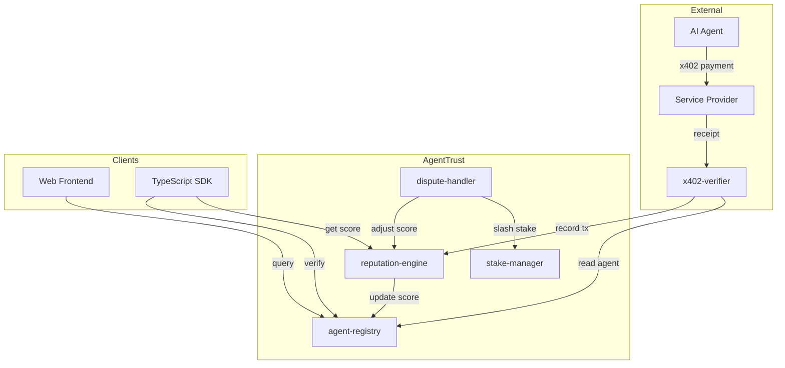

# AgentTrust

### The Trust Layer for AI Agents on Stellar

---

## The Problem

AI agents are entering an era of autonomous economic activity. With protocols like x402, agents can discover services, negotiate prices, and make payments without human intervention. But payment ability is not trust. When an AI agent sends your API an x402 payment, you know it can pay -- you do not know if it will deliver, if it has a track record, or if other participants in the network vouch for it. There is no infrastructure for agent reputation.

Meanwhile, agent infrastructure is concentrating on a handful of chains. Base and Ethereum L2s dominate the early agent economy because they shipped developer tooling first. Stellar -- with its low fees, 5-second finality, and native asset support -- is better suited for high-frequency agent transactions, but it lacks the trust infrastructure that makes agent economies viable. Without a reputation layer, Stellar cannot compete for the agent economy.

AgentTrust fills this gap. It is an on-chain attestation and reputation registry that gives every AI agent on Stellar a verifiable trust score. Service providers can query it in real time to decide whether to accept an agent's x402 payment. Agents build reputation through successful transactions, staking, and third-party attestations. Bad actors lose stake and score through a dispute system. The result is a permissionless trust layer that makes the Stellar agent economy possible.

## How It Works

**Register.** An agent operator registers their agent on-chain by providing a Stellar address, metadata URI, declared capabilities, and a minimum stake of 100 XLM. The agent starts with a trust score of zero and an "Unverified" tier.

**Build Reputation.** As the agent completes x402 transactions, each successful interaction is recorded on-chain via the reputation engine. The agent's trust score rises based on five weighted factors: success rate (40%), transaction volume (20%), account age (10%), third-party attestations (15%), and staked XLM (15%). Over time, consistent performance moves the agent through tiers -- Emerging, Established, Trusted, and Elite.

**Verify.** Service providers use the AgentTrust SDK or API to verify an agent before accepting its x402 payment. A single call returns the agent's score, tier, status, transaction history, and any warning flags. The service sets a minimum threshold and accepts or rejects the agent in milliseconds. Inactive agents decay at 2% per week, and disputed agents face stake slashing and score penalties, keeping the registry honest.

## Architecture



## Quick Start

### For Users: Verify an Agent

Visit the AgentTrust web interface, paste a Stellar address, and instantly see the agent's trust score, tier, transaction history, and any flags.

### For Developers: Verify in Code

```bash
npm install @agent-trust/sdk
```

```typescript
import { AgentTrustClient } from "@agent-trust/sdk";

const client = new AgentTrustClient({
  network: "testnet",
  contractIds: {
    registry: process.env.AGENT_REGISTRY_CONTRACT_ID,
    reputation: process.env.REPUTATION_ENGINE_CONTRACT_ID,
  },
});
const result = await client.verify("GAGENT_ADDRESS_HERE");

if (result.score >= 5000 && result.status === "active") {
  // Agent is trusted -- serve the request
}
```

Gate your API with middleware:

```typescript
import { AgentTrustMiddleware } from "@agent-trust/sdk";

// Express
app.use("/api", AgentTrustMiddleware.express({ minScore: 5000 }));

// Hono
app.use("/api/*", AgentTrustMiddleware.hono({ minScore: 5000 }));
```

### For Agent Operators: Register Your Agent

```bash
stellar contract invoke \
  --id $AGENT_REGISTRY_CONTRACT_ID \
  --network testnet \
  --source my-agent-identity \
  -- register_agent \
  --owner $MY_ADDRESS \
  --agent_address $MY_ADDRESS \
  --metadata_uri "https://example.com/agent.json" \
  --capabilities '["translation","code_review"]' \
  --initial_stake 1000000000
```

The current TypeScript SDK is read-only. Submit registrations with the Stellar
CLI above or through the web registration flow.

## Tech Stack

| Layer | Technology |
|-------|-----------|
| Smart Contracts | Rust, Soroban SDK 27.x |
| Blockchain | Stellar / Soroban |
| Frontend | Next.js 14, React 18, Tailwind CSS |
| Wallet | passkey-kit (WebAuthn), Launchtube |
| SDK | TypeScript, @stellar/stellar-sdk |
| CI | GitHub Actions |
| Payment Protocol | x402 |

## Project Structure

```
agenttrust/
  contracts/
    agent-registry/       # Core identity and attestation registry
    reputation-engine/    # Trust score calculation and decay
    stake-manager/        # XLM staking, withdrawals, slashing
    dispute-handler/      # Claim filing, response, resolution
    x402-verifier/        # x402 receipt verification bridge
  frontend/
    src/
      app/                # Next.js App Router pages
      components/         # UI components (layout, ui)
      lib/                # Stellar, contracts, passkey, x402 utils
      types/              # TypeScript type definitions
  sdk/
    src/                  # AgentTrust TypeScript SDK
  scripts/
    deploy.sh             # Build and deploy contracts to testnet
    initialize.sh         # Initialize deployed contracts
    seed-testnet.sh       # Create sample agents and data
  docs/
    architecture.md       # System design overview
    protocol-spec.md      # Detailed protocol rules
    trust-score-algorithm.md  # Scoring formula breakdown
    x402-integration.md   # x402 integration guide
    sdk-quickstart.md     # SDK quick start guide
    api-reference.md      # Complete API documentation
    diagrams/             # Mermaid diagrams
  .github/
    workflows/ci.yml      # CI pipeline
    PULL_REQUEST_TEMPLATE.md
    ISSUE_TEMPLATE/
```

## Development Setup

### Prerequisites

- **Rust** (stable, with `wasm32v1-none` target)
- **stellar-cli** (`cargo install --locked stellar-cli`)
- **Node.js** 20+
- **npm** 9+

### Build Contracts

```bash
# Add WASM target if not already installed
rustup target add wasm32v1-none

# Build all contracts
cargo build --release --target wasm32v1-none

# Run contract tests
cargo test --workspace
```

### Run Frontend

```bash
cd frontend
npm install
npm run dev
# Open http://localhost:3000
```

### Deploy to Testnet

```bash
# Build and deploy all contracts
./scripts/deploy.sh

# Initialize contracts with admin and link them
./scripts/initialize.sh

# Create sample agents and data
./scripts/seed-testnet.sh
```

### Build SDK

```bash
cd sdk
npm install
npm run build
```

## Contributing

Contributions are welcome. Please follow these steps:

1. Fork the repository
2. Create a feature branch (`git checkout -b feature/your-feature`)
3. Make your changes
4. Run tests (`cargo test --workspace` for contracts, `npm run build` for frontend/SDK)
5. Submit a pull request using the PR template

See the [Architecture docs](docs/architecture.md) for an overview of the system design, and the [API Reference](docs/api-reference.md) for contract function signatures.

## License

MIT License. See [LICENSE](LICENSE) for details.
