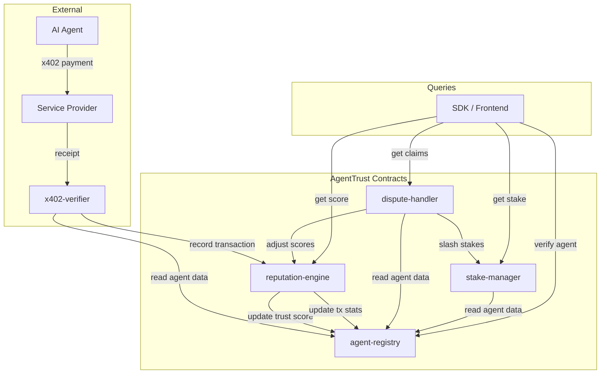

# AgentTrust Architecture

## Overview

AgentTrust is an on-chain agent attestation and reputation registry built on Stellar/Soroban. It provides trust infrastructure for the emerging x402 agent economy, where AI agents autonomously transact for services over HTTP using the x402 payment protocol.

The core problem AgentTrust solves: when an AI agent sends an x402 payment request to your API, how do you know whether that agent is trustworthy? AgentTrust maintains a decentralized, on-chain reputation system that service providers can query in real time to make accept/reject decisions.

AgentTrust consists of five Soroban smart contracts, a Next.js frontend for human interaction, and a TypeScript SDK for programmatic access. Together they form a complete trust layer that sits between x402 payment flows and the services agents consume.

## Contract Architecture

AgentTrust is composed of five smart contracts, each handling a specific domain:

### agent-registry

The core identity contract. Manages agent registration, metadata storage, capability declarations, attestations, and status tracking. Every agent in the system has a record here containing their owner address, on-chain agent address, metadata URI, declared capabilities, trust score, transaction statistics, stake amount, and current status (Active, Suspended, or Deregistering).

Key responsibilities:
- Agent registration with minimum stake enforcement (100 XLM)
- Metadata URI storage and updates
- Capability declarations (e.g., "translation", "code_review", "data_analysis")
- Third-party attestation management (add, revoke)
- Agent search by capability and minimum trust score
- Trust score and transaction statistics updates (called by reputation-engine via admin)
- Agent suspension (admin) and deregistration (owner)

### reputation-engine

Calculates and maintains trust scores using a weighted multi-factor formula. Records transaction history, computes score breakdowns, applies time-based decay for inactive agents, and provides score adjustment capabilities for the dispute system.

Key responsibilities:
- Transaction recording with counterparty, amount, and success/failure tracking
- Trust score calculation using five weighted components (success rate, volume, age, attestations, stake)
- Score decay at 2% per week of inactivity
- Score adjustment (positive or negative) for dispute outcomes
- Trust tier assignment (Unverified, Emerging, Established, Trusted, Elite)
- Transaction history retrieval with pagination

### stake-manager

Handles economic security through XLM staking. Manages stake deposits, withdrawal requests with a 7-day cooldown period, withdrawal completion, and slashing for dispute losses or fraud.

Key responsibilities:
- Stake deposits via Stellar token transfers
- Withdrawal requests with 7-day unbonding cooldown
- Withdrawal completion after cooldown expires
- Withdrawal cancellation
- Stake slashing (10% for dispute loss, 50% for confirmed fraud)
- Slashed tokens sent to protocol treasury
- Dispute-handler contract authorization for slashing

### dispute-handler

Manages the dispute resolution lifecycle. Handles claim filing, responses from accused agents, and admin-driven resolution with consequences that flow to reputation-engine and stake-manager.

Key responsibilities:
- Claim filing with evidence hash, transaction hash, and claim type
- Claim types: NonDelivery, PoorQuality, Fraud, Overcharge, Other
- Agent response to claims with response evidence
- Admin resolution: AgainstAgent, ForAgent, or Dismissed
- Automatic slash rate determination (10% dispute loss, 50% fraud)
- Claim status tracking (Open, Responded, Resolved)
- Claims queryable by agent ID or by status

### x402-verifier

Bridges x402 payment receipts to on-chain reputation data. Validates receipt structure, prevents double-counting via hash deduplication, and records verified transactions that feed into the reputation engine.

Key responsibilities:
- x402 receipt verification with structural validation
- Receipt deduplication via SHA-256 hashing
- Facilitator authorization management
- Verified transaction storage and retrieval
- Timestamp validation with 1-hour drift tolerance

## Contract Interaction Diagram



## Data Flow

The complete flow from an x402 transaction to a trust score update:

1. **Agent performs service**: An AI agent pays for an API call using the x402 payment protocol. The payment flows through a facilitator who co-signs the receipt.

2. **Receipt generated**: The x402 facilitator generates a signed receipt containing the payer (agent), payee (service), amount, resource accessed, timestamp, and facilitator signature.

3. **x402-verifier validates receipt**: The facilitator or admin submits the receipt to the x402-verifier contract. The contract validates the receipt structure (positive amount, reasonable timestamp), computes a SHA-256 hash to prevent double-counting, and stores the verified receipt.

4. **reputation-engine records transaction**: The admin (or an automated pipeline acting as admin) calls `record_transaction` on the reputation-engine with the agent ID, counterparty, amount, success status, and receipt hash. The engine updates the agent's cumulative statistics (total transactions, successful transactions, total volume) and last-activity timestamp.

5. **Score recalculated**: The `calculate_score` function computes a fresh score breakdown using the five weighted components and updates the agent's cached score in the reputation engine's storage.

6. **agent-registry updated**: The admin calls `update_trust_score` and `update_transaction_stats` on the agent-registry to propagate the new score and statistics to the agent's canonical record.

7. **Tier assigned**: The reputation engine maps the numeric score (0-10000) to a trust tier (Unverified, Emerging, Established, Trusted, or Elite) which service providers use for accept/reject decisions.

## Frontend Architecture

The frontend is a Next.js 14 application using the App Router pattern.

### Component Hierarchy

```
app/
  layout.tsx          -- Root layout with providers
  page.tsx            -- Landing / search page
  providers.tsx       -- Context providers (wallet, theme)
  globals.css         -- Tailwind base styles

components/
  layout/
    Header.tsx        -- Navigation, wallet connect button
    Footer.tsx        -- Links, network indicator
  ui/
    Button.tsx        -- Styled button variants
    Card.tsx          -- Content card container
    Badge.tsx         -- Trust tier badges
    Search.tsx        -- Agent search input
    Modal.tsx         -- Dialog overlays
    Toast.tsx         -- Notification toasts

lib/
    stellar.ts        -- Stellar SDK initialization, RPC client
    contracts.ts      -- Contract client wrappers
    passkey.ts        -- Passkey-kit wallet integration
    launchtube.ts     -- Launchtube transaction submission
    x402.ts           -- x402 receipt parsing utilities
    utils.ts          -- General helpers

types/
    agent.ts          -- Agent type definitions
    reputation.ts     -- Score, tier, breakdown types
    contract.ts       -- Contract interaction types
    index.ts          -- Re-exports
```

### Wallet Integration

AgentTrust uses **passkey-kit** for wallet authentication, providing a seamless experience where users authenticate with device biometrics (fingerprint, Face ID) instead of managing seed phrases. Transactions are submitted through **Launchtube**, which handles fee sponsorship and transaction assembly.

This approach is critical for Global South adoption where users may not have prior crypto wallet experience.

## SDK Architecture

The TypeScript SDK (`@agent-trust/sdk`) provides three layers:

### Client Layer

The core `AgentTrustClient` class wraps Soroban RPC calls to query the agent-registry and reputation-engine contracts. It handles network configuration, contract address resolution, and response deserialization.

```
AgentTrustClient
  ├── verify(address)        -> AgentTrustResult
  ├── getAgent(address)      -> Agent data
  ├── getScore(agentId)      -> ScoreResult
  ├── getBreakdown(agentId)  -> ScoreBreakdown
  └── searchAgents(cap, min) -> Agent[]
```

### Verifier Layer

The `AgentTrustVerifier` wraps the client with policy logic: minimum score thresholds, required tiers, flag generation (warnings for low scores, new agents, inactive agents, suspended status), and caching.

### Middleware Layer

Pre-built middleware for Express and Hono that intercepts incoming requests, extracts the agent's Stellar address from the x402 payment header, verifies the agent's trust score, and accepts or rejects the request based on configurable thresholds.
