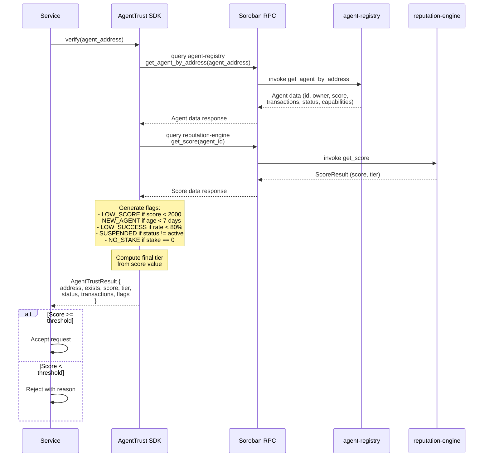

# Verification Sequence

This diagram shows the sequence of calls when a service provider verifies an agent using the AgentTrust SDK.

## Flow Description

### 1. Service calls SDK

The service provider calls `verify(agent_address)` with the Stellar address extracted from the x402 payment receipt.

### 2. SDK queries agent-registry

The SDK makes a Soroban RPC call to the `agent-registry` contract's `get_agent_by_address` function. This returns the full `Agent` struct containing:
- `id`: Sequential agent ID
- `owner`: Owner's Stellar address
- `agent_address`: The agent's on-chain address
- `metadata_uri`: Link to off-chain metadata
- `capabilities`: Declared capability list
- `trust_score`: Current trust score
- `total_transactions`: Lifetime transaction count
- `successful_transactions`: Successful transaction count
- `total_volume`: Lifetime volume in stroops
- `registered_at`: Registration timestamp
- `stake`: Current stake in stroops
- `status`: Active, Suspended, or Deregistering

### 3. SDK queries reputation-engine

The SDK makes a second RPC call to the `reputation-engine` contract's `get_score` function, which returns the current `ScoreResult` (score and tier).

### 4. SDK generates flags

The SDK analyzes the agent data and generates warning/danger flags:

| Flag Code | Type | Condition |
|-----------|------|-----------|
| `LOW_SCORE` | warning | Score < 2,000 |
| `NEW_AGENT` | info | Registered < 7 days ago |
| `LOW_SUCCESS_RATE` | warning | Success rate < 80% |
| `SUSPENDED` | danger | Status is Suspended |
| `DEREGISTERING` | warning | Status is Deregistering |
| `NO_STAKE` | warning | Stake is 0 |
| `LOW_VOLUME` | info | Total volume < 100 XLM |

### 5. SDK returns result

The SDK returns an `AgentTrustResult` object to the service with all data needed to make an accept/reject decision.

### 6. Service decides

The service compares the result against its configured thresholds (minimum score, minimum tier, required active status) and either accepts or rejects the request.
